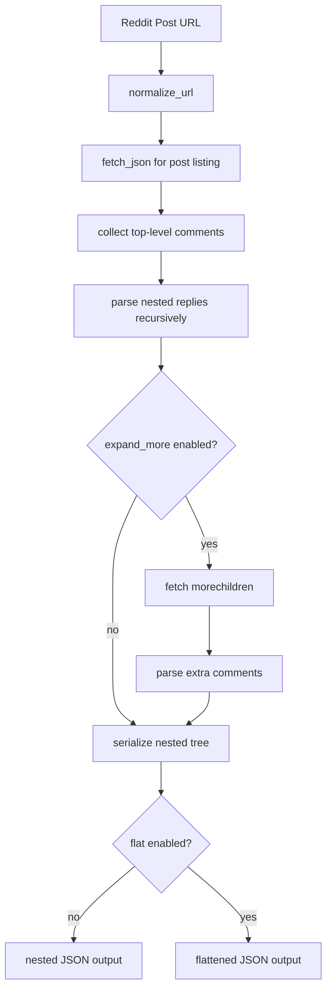

# ThreadSense Overview

> Turn discussion threads into evidence-backed product intelligence.

## Summary

ThreadSense is a discussion-intelligence system for extracting structured signals from long-form community conversations. The current repository contains an MVP ingestion path centered on Reddit comment retrieval. The long-term product is a full pipeline that starts with thread discovery, normalizes conversation structure, scores relevance, extracts repeated signals, and emits reports that teams can use for product, market, and competitive decisions.

The reference implementation in [`.docs/reddit_scraper.py`](.docs/reddit_scraper.py) is the anchor for the current design. It is not a generic vision document. It is the concrete baseline the rest of the system should extend.

## What Exists Today

The current implementation supports a single narrow but important workflow:

1. Accept a Reddit post URL.
2. Normalize the URL to Reddit's `.json` endpoint.
3. Fetch post metadata and top-level comment listings from the public Reddit API.
4. Parse nested comment trees recursively.
5. Optionally expand `MoreComments` placeholders through `/api/morechildren.json`.
6. Optionally flatten the nested comment tree into a linear sequence.
7. Serialize the result to JSON.

That gives ThreadSense a working ingestion core for one source and one input mode: direct thread analysis from Reddit.

### Current MVP Capabilities

- Public Reddit post ingestion without OAuth or PRAW
- Recursive parsing of nested comment trees
- Filtering of deleted or removed comments
- Preservation of thread structure through `depth`, `parent_id`, and nested `replies`
- Optional expansion of deferred comment branches
- Export to JSON for downstream analysis

### Current MVP Limits

- No query-based discovery
- No multi-thread aggregation
- No cross-platform connectors
- No persistence layer beyond JSON output
- No ranking, clustering, sentiment, or theme extraction
- No API service or worker orchestration
- No caching, retry policy, or batch execution framework

This distinction matters. The docs should treat the script as the implemented system boundary and describe the rest as the designed next layer.

## Why ThreadSense Matters

Teams routinely mine Reddit, forums, Discord summaries, GitHub discussions, and community threads for product intelligence. The raw material is valuable, but the operational workflow is weak:

- manual reading does not scale
- screenshots and notes are not reproducible
- anecdotal summaries lose evidence chains
- repeated complaints disappear into long threads
- niche but high-signal viewpoints get buried

ThreadSense exists to convert unstructured conversations into a process that is deterministic, inspectable, and extensible.

The core thesis is straightforward: product and research teams do not need more raw discussion data. They need a system that preserves source evidence while compressing conversation volume into actionable patterns.

## Brain Model Strategy

ThreadSense should treat the LLM layer as a pluggable reasoning backend, not a hardcoded vendor dependency.

The system needs to support two inference modes:

- cloud-hosted LLMs reached through provider APIs
- local LLMs executed on infrastructure the operator controls

Local inference should explicitly support:

- Ollama as a local model serving API
- `llama.cpp` for direct local inference and self-hosted service wrappers

This matters for three reasons:

- privacy-sensitive research workflows may not allow discussion data to leave the local environment
- cloud inference is operationally simpler for stronger frontier models and burst capacity
- teams need the ability to choose trade-offs across latency, cost, quality, and data residency

The correct design is hybrid. Deterministic ingestion and extraction stay provider-agnostic. The reasoning layer chooses the best available backend for the task.

## Product Direction

ThreadSense should evolve in four layers.

### 1. Ingestion

Acquire discussions from one or more sources while preserving metadata, hierarchy, timestamps, and permalinks.

Current state:

- implemented for direct Reddit post URLs

Target state:

- query-based Reddit discovery
- subreddit-scoped retrieval
- date filtering
- additional connectors for other public discussion systems

### 2. Normalization

Convert source-specific payloads into a stable internal schema so downstream analysis does not care whether a comment originated from Reddit or another platform.

Current state:

- partial normalization through the `Comment` dataclass

Target state:

- canonical `Thread`, `Comment`, `Author`, and `Source` models
- explicit provenance fields
- normalized timestamps, scores, and parent-child relationships

### 3. Analysis

Detect repeated pain points, feature requests, terminology shifts, and emerging themes. This stage should remain evidence-first: every claim must trace back to comments or threads.

Current state:

- not implemented in code

Target state:

- deduplication
- relevance scoring
- quote extraction
- issue/request classification
- theme grouping
- confidence scoring

### 3a. Inference Backends

Use LLMs only where they add value above deterministic extraction, and keep provider selection outside business logic.

Current state:

- no inference backend is implemented

Target state:

- cloud-provider adapter for hosted LLM APIs
- Ollama adapter for local model serving
- `llama.cpp` adapter for direct local inference or wrapped HTTP serving
- task-based routing so lightweight local models can handle extraction or compression while stronger cloud models handle synthesis when allowed
- configuration-driven model selection per environment and per task

### 4. Reporting

Package results into outputs that humans can act on and machines can consume.

Current state:

- raw JSON export

Target state:

- Markdown reports
- structured JSON for programmatic use
- evidence bundles with permalinks
- summaries tuned for product, research, and competitive analysis workflows

## Intended Users

ThreadSense is most useful where discussion threads are a primary source of external truth.

Primary users:

- product managers validating demand or pain points
- founders researching competitors and underserved segments
- developer relations teams tracking community friction
- researchers studying technical discourse
- analysts building evidence-backed market notes

Secondary users:

- UX researchers
- technical writers
- community operators
- internal strategy teams

## Core Use Cases

### Competitor Friction Analysis

Input:

- a competitor's Reddit thread, launch discussion, or complaint-heavy post

Output:

- repeated complaints
- representative quotes
- severity signals based on frequency and score

### Feature Demand Mapping

Input:

- threads discussing a category or workflow

Output:

- clusters of requested capabilities
- user language describing the need
- common blockers and edge cases

### Community Sentiment With Evidence

Input:

- threads around a product release or ecosystem event

Output:

- positive and negative themes
- top supporting comments
- minority but high-signal viewpoints

### Research Archive Generation

Input:

- a set of URLs or discovered threads

Output:

- normalized thread corpus ready for offline analysis or LLM-assisted synthesis

## Design Principles

ThreadSense should follow a few non-negotiable rules.

### Evidence First

Insights without citations are not product intelligence. Every output needs direct links back to comments or threads.

### Deterministic Core, AI on Top

Retrieval, parsing, normalization, and scoring primitives should be deterministic. LLM-assisted summarization belongs above a stable evidence layer, not instead of it.

### Inference Portability

No analysis stage should depend on a single LLM vendor or runtime. The system should be able to switch between cloud APIs and local runtimes without changing the analysis contract.

### Fail Fast at the Boundary

Invalid URLs, malformed payloads, and rate-limit failures should surface explicitly. Hidden fallbacks make research pipelines untrustworthy.

### Source-Agnostic Internal Model

Reddit is the current ingestion target, not the long-term system boundary. Internal models should be designed for connector reuse.

### Reproducibility Over Flash

A saved corpus, stable schema, and repeatable analysis pipeline are more valuable than a polished dashboard built on brittle extraction logic.

## Current Execution Flow

The reference script executes a simple but sound path:

This is the actual system behavior today. All higher-level plans should preserve this ingestion path and harden it rather than bypass it.

## System Boundaries

### In Scope Today

- single-thread Reddit ingestion
- nested comment parsing
- JSON export suitable for downstream scripts

### Out of Scope Today

- multi-source discovery
- production API serving
- background jobs
- persistent indexing
- semantic search
- dashboarding
- report orchestration
- cloud or local LLM integration

The docs should keep this separation explicit so future contributors know what is implemented, what is planned, and where to extend the system.

## Primary Risks

### Source Stability Risk

The current scraper uses Reddit's public JSON interface. It is widely used, but it is still an external dependency with policy and shape-change risk.

Mitigation:

- isolate Reddit-specific logic behind a connector boundary
- validate response shape aggressively
- keep replayable fixture data for regression testing

### Rate Limiting and Throughput

The current script uses a fixed inter-request delay. That is acceptable for a single-thread CLI path, not for scaled ingestion.

Mitigation:

- introduce bounded retries with explicit backoff
- cache repeated thread fetches
- batch multi-thread jobs through worker queues

### Analysis Credibility

Once AI-assisted summarization is added, unsupported claims become the core product risk.

Mitigation:

- require citation-backed outputs
- separate extracted evidence from generated interpretation
- attach confidence and coverage indicators to reports

### Inference Deployment Risk

Different LLM backends will produce different output quality, latency, and operational complexity.

Mitigation:

- keep prompt contracts and output schemas stable across providers
- route privacy-sensitive workloads to local inference
- evaluate local and cloud models against the same evidence-backed benchmarks
- reserve cloud escalation for tasks local models cannot meet at the required quality bar

### Sampling Bias

Discussion platforms reflect a specific audience, not the full market.

Mitigation:

- label source coverage explicitly
- track source mix in every report
- avoid universal claims from single-community datasets

## Roadmap Shape

The clean expansion path from the current MVP is:

1. Harden Reddit ingestion.
2. Define canonical internal schemas.
3. Add thread discovery and batch processing.
4. Add deterministic extraction and ranking.
5. Layer report generation on top of evidence bundles.
6. Introduce APIs, persistence, queues, and observability only after the analysis contract is stable.

That order preserves engineering leverage. It avoids building infrastructure around a weak or unstable data model.

## Success Criteria

ThreadSense is succeeding when it can do all of the following reliably:

- ingest discussion threads without manual repair
- preserve comment hierarchy and provenance
- extract repeatable signals across runs
- attach every claim to source evidence
- generate outputs that reduce manual research time materially

Until then, the correct framing is not "finished insight engine." It is "a discussion-ingestion MVP with a clear path to a rigorous intelligence pipeline."
