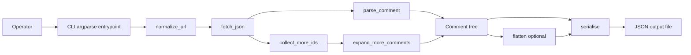
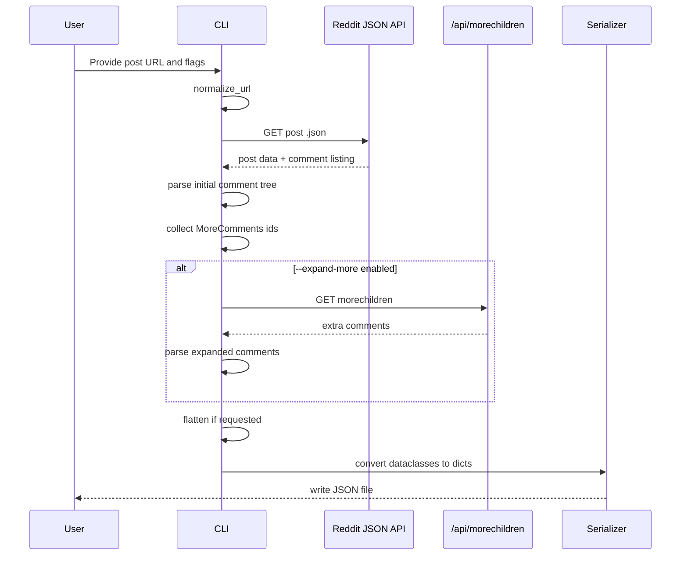
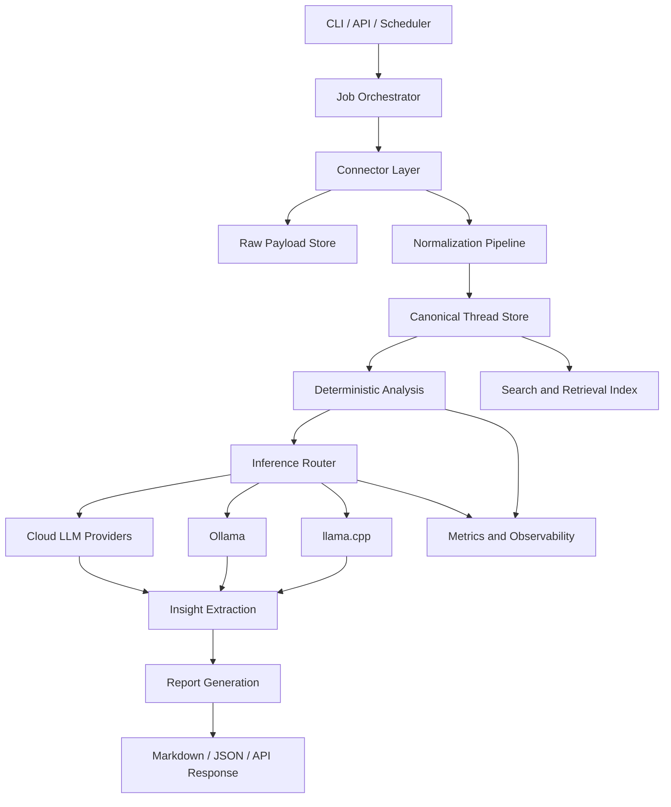

# ThreadSense System Design

## Purpose

This document describes the system that exists in the repository today and the production architecture it should evolve into. The implemented baseline is [`.docs/reddit_scraper.py`](.docs/reddit_scraper.py). Every design decision in this document should remain compatible with that baseline unless the implementation is intentionally replaced.

## Current Implemented Architecture

The current codebase is a single-process CLI ingestion tool for Reddit post comments.



This design is intentionally narrow:

- one input URL
- one external source
- synchronous HTTP requests
- one in-memory representation of the thread
- one file output

That narrowness is a strength for the MVP. It makes the data model and failure modes obvious.

## Current Module Responsibilities

### `normalize_url`

Responsibility:

- strip query parameters and fragments
- force `.json` suffix on the Reddit path

Why it matters:

- prevents downstream variability from user-pasted URLs
- makes retrieval deterministic

### `fetch_json`

Responsibility:

- perform the HTTP GET with a descriptive `User-Agent`
- enforce a timeout
- raise on non-2xx responses

Why it matters:

- this is the network boundary
- failures are explicit instead of silently coerced

### `parse_comment`

Responsibility:

- convert one Reddit comment payload into the internal `Comment` structure
- recurse through nested replies
- skip removed or deleted comments

Why it matters:

- this is the effective normalization stage in the current system
- it preserves hierarchy, score, timestamps, and provenance fields

### `collect_more_ids`

Responsibility:

- separate immediately available comments from deferred `kind == "more"` placeholders

Why it matters:

- Reddit comment trees are incomplete by default for large threads
- this function exposes the expansion boundary cleanly

### `expand_more_comments`

Responsibility:

- call Reddit's `/api/morechildren.json`
- expand deferred comment branches
- return parsed comment objects

Why it matters:

- makes thread coverage configurable
- isolates extra API calls behind a distinct feature flag

### `flatten`

Responsibility:

- transform a nested comment tree into a depth-preserving linear list

Why it matters:

- nested output is better for structure-aware rendering
- flat output is better for downstream indexing and scoring

### `serialise`

Responsibility:

- convert dataclass instances into JSON-compatible dictionaries

Why it matters:

- defines the external data contract of the current MVP

## Current Data Model

The implemented canonical object is:

```python
@dataclass
class Comment:
    id: str
    author: str
    body: str
    score: int
    created_utc: float
    depth: int
    parent_id: str
    permalink: str
    replies: list["Comment"]
```

### What This Model Gets Right

- preserves parent-child structure
- stores enough metadata for evidence traceability
- supports both tree and flattened views
- keeps the model source-neutral enough to evolve later

### What Is Missing for the Next Stage

- source identifier
- thread identifier separate from parent identifier
- normalized author metadata
- retrieval timestamp
- source payload checksum or version marker
- deleted/removed state instead of hard skip if full fidelity is required

## Current Runtime Flow



## Operational Characteristics of the MVP

### Execution Model

- synchronous
- single-threaded
- memory-resident data structures
- file-based output

### Throughput Profile

The tool is suitable for one-off research pulls, manual analysis, and fixture generation. It is not sufficient for bulk crawling or scheduled intelligence workflows.

### Reliability Profile

The script already does two things correctly:

- identifies the network boundary clearly
- raises hard failures on HTTP errors

It still needs explicit handling for:

- transient network failures
- malformed Reddit payloads
- rate-limit responses
- partial expansion failures when `morechildren` only partially returns data

## Failure Modes

### Invalid Input URL

Current behavior:

- malformed or non-post URLs fail later during retrieval or response-shape assumptions

Target behavior:

- validate URL shape before the first HTTP request
- reject unsupported Reddit URL forms explicitly

### API Shape Drift

Current behavior:

- several nested dictionary accesses assume stable Reddit payloads

Target behavior:

- validate required keys at the response boundary
- raise domain-specific errors with enough context for debugging

### Rate Limiting

Current behavior:

- fixed `REQUEST_DELAY`

Target behavior:

- bounded retry policy
- exponential backoff with jitter
- explicit rate-limit telemetry

### Large Threads

Current behavior:

- entire thread held in memory

Target behavior:

- keep the in-memory path for moderate threads
- add streaming or chunked persistence when expanding to large-scale runs

## Extension Strategy

The correct way to grow the system is to split the script into stable boundaries, not to pile more logic into one file.

Recommended near-term packages or modules:

- `threadsense/connectors/reddit.py`
  Reddit-specific URL normalization, fetches, and payload translation
- `threadsense/models.py`
  canonical thread and comment schemas
- `threadsense/pipeline/ingest.py`
  ingestion orchestration for one thread or batch
- `threadsense/pipeline/normalize.py`
  source payload to canonical model transformations
- `threadsense/pipeline/analyze.py`
  deterministic scoring, extraction, and grouping
- `threadsense/inference/base.py`
  provider-agnostic inference interface and task contracts
- `threadsense/inference/cloud.py`
  hosted LLM provider adapters
- `threadsense/inference/ollama.py`
  local inference adapter for Ollama
- `threadsense/inference/llama_cpp.py`
  local inference adapter for `llama.cpp`
- `threadsense/inference/router.py`
  policy engine for backend and model selection
- `threadsense/reporting/markdown.py`
  report rendering
- `threadsense/cli.py`
  user-facing execution surface

This keeps source adapters, analysis logic, and report rendering isolated.

## Inference Architecture

LLMs should sit behind a narrow inference boundary. Analysis code should request a task outcome, not a specific vendor API.

Recommended contract:

```text
InferenceRequest
- task_type
- input_documents
- evidence
- output_schema
- privacy_mode
- latency_budget
- quality_tier

InferenceResponse
- provider
- model
- output
- citations
- token_usage or local runtime metrics
- latency_ms
- finish_reason
```

### Supported Backend Classes

#### Cloud LLM Providers

Use hosted APIs when the task benefits from stronger models, larger context windows, or elastic throughput.

Typical use:

- high-quality synthesis
- complex multi-thread summarization
- report drafting when data residency allows it

#### Ollama

Use Ollama when the operator wants a local HTTP-style model runtime with simple deployment semantics.

Typical use:

- on-device or self-hosted inference
- privacy-sensitive corpora
- lightweight extraction and classification tasks
- development and offline workflows

#### `llama.cpp`

Use `llama.cpp` when tight control over local inference performance, quantization, and hardware utilization matters.

Typical use:

- direct local execution on CPU or GPU
- constrained hardware environments
- custom serving setups built around `llama.cpp`
- lower-level runtime tuning than Ollama exposes

### Routing Policy

Backend selection should be policy-driven rather than hardcoded in application logic.

Minimum routing dimensions:

- `privacy_mode`
  local-only, cloud-allowed, or hybrid
- `task_type`
  extraction, classification, clustering assist, synthesis, report writing
- `quality_tier`
  fast, balanced, or high-accuracy
- `latency_budget`
  interactive or batch
- `cost_budget`
  local-preferred, mixed, or cloud-preferred

Example policy:

- run deterministic extraction first
- send small classification or tagging tasks to local models when quality is acceptable
- escalate only high-complexity synthesis tasks to cloud models when policy permits
- force local execution for restricted datasets

## Target Production Architecture

Once the MVP ingestion contract is stable, the system should evolve into the following architecture:



### Layer Responsibilities

#### Connector Layer

- source-specific acquisition
- rate limiting
- authentication if a source later requires it
- payload capture for replay and debugging

#### Raw Payload Store

- immutable copy of source responses
- enables reprocessing without re-scraping
- supports regression testing against historical payloads

#### Normalization Pipeline

- transforms source payloads into canonical thread objects
- resolves schema variance across connectors

#### Canonical Thread Store

- source-agnostic conversation corpus
- base layer for analysis, search, and report generation

#### Deterministic Analysis

- deduplication
- frequency counting
- ranking
- quote selection
- simple rule-based classification

#### Inference Router

- selects cloud or local backend per task
- enforces privacy and residency rules
- binds task contracts to provider-specific prompts or schemas
- records provider choice, latency, and fallback decisions

#### Cloud LLM Providers

- hosted inference for high-capability tasks
- larger context and burst capacity
- strongest option for synthesis when data policy allows external transfer

#### Ollama

- local HTTP-based inference backend
- straightforward self-hosted deployment
- good default path for operator-managed local models

#### `llama.cpp`

- direct local runtime for quantized models
- suitable for CPU-heavy or tightly controlled deployments
- useful when the system needs low-level performance control

#### Insight Extraction

- theme grouping
- evidence packaging
- optional LLM summarization constrained by retrieved evidence
- post-process validation to ensure outputs map back to canonical evidence

#### Report Generation

- Markdown narrative for humans
- structured JSON for downstream systems
- evidence appendices

## Local and Cloud Execution Modes

The system should support three operating modes.

### Cloud-First

Use hosted LLMs for reasoning tasks. This mode optimizes for capability and operational simplicity.

Best for:

- high-quality synthesis
- teams already operating in a cloud environment
- workflows without strict data-locality constraints

### Local-First

Use Ollama or `llama.cpp` for all reasoning tasks unless explicitly overridden. This mode optimizes for privacy, offline execution, and cost control.

Best for:

- regulated or sensitive datasets
- on-prem deployments
- teams willing to trade some model quality for control

### Hybrid

Use local inference by default and escalate selected tasks to cloud providers only when policy permits and the task needs stronger models.

Best for:

- cost-sensitive production systems
- privacy-aware research workflows
- staged report generation where extraction remains local and synthesis is conditional

## Prompt and Output Discipline

Prompt templates, output schemas, and evaluation criteria must be shared across providers. Do not fork business logic by model backend.

Required controls:

- one prompt contract per task type
- structured outputs with validation
- evidence IDs passed into every summarization task
- provider-specific adapters only at the transport and formatting boundary

This keeps Ollama, `llama.cpp`, and cloud providers interchangeable at the orchestration layer.

## Failure Modes for LLM Backends

### Local Model Quality Drift

Smaller local models may fail on nuanced clustering or synthesis tasks.

Mitigation:

- benchmark local models per task type
- reserve complex synthesis for approved stronger models
- validate generated outputs against evidence coverage rules

### Runtime Availability

Ollama or `llama.cpp` services may be unavailable on a node or workstation.

Mitigation:

- fail explicitly when a required local backend is missing
- surface provider health in preflight checks
- allow policy-controlled rerouting only when privacy mode permits it

### Schema Violations

Different backends may return malformed structured outputs.

Mitigation:

- validate every response against task schemas
- retry with repair prompts only within bounded limits
- reject unparseable outputs instead of silently coercing them

### Cost and Latency Spikes

Cloud inference can become expensive and local inference can become slow under larger models.

Mitigation:

- route simple tasks to deterministic or local paths first
- record per-task latency and cost metrics
- enforce configurable thresholds in the inference router

## Data Contracts for the Next Phase

The next stable contract should promote `Comment` into a wider thread document:

```text
Thread
- thread_id
- source
- source_url
- title
- body
- author
- created_utc
- retrieved_utc
- metadata
- comments[]

Comment
- comment_id
- thread_id
- source
- parent_comment_id | null
- author
- body
- score
- created_utc
- depth
- permalink
- flags
```

Keep source-specific raw fields in a nested metadata object. Do not let source quirks leak into the top-level analysis contract.

## Non-Functional Requirements

### Traceability

Every generated insight must map back to concrete comment identifiers and permalinks.

### Determinism

For a fixed input corpus and fixed analysis settings, the system should generate stable outputs.

### Inspectability

Operators need to tell which stage failed: acquisition, normalization, analysis, or rendering.

### Replaceability

Reddit-specific retrieval must remain replaceable without rewriting analysis logic.

### Cost Discipline

Expensive LLM calls belong after deterministic filtering has reduced the candidate set.

### Provider Independence

No report quality guarantee should depend on one provider being available. The architecture must preserve a working local path through Ollama or `llama.cpp` and a working cloud path through hosted APIs.

## Recommended Build Sequence

1. Extract the current script into reusable modules without changing behavior.
2. Add typed canonical models for threads and comments.
3. Add response validation and explicit error types.
4. Add batch ingestion for multiple URLs.
5. Persist raw payloads and normalized outputs separately.
6. Add the inference abstraction and implement cloud, Ollama, and `llama.cpp` adapters.
7. Add deterministic extraction and report rendering.
8. Add API and worker infrastructure only after the data contracts settle.

This sequence keeps the system honest. It avoids building distributed infrastructure before the ingestion and analysis contracts are trustworthy.
