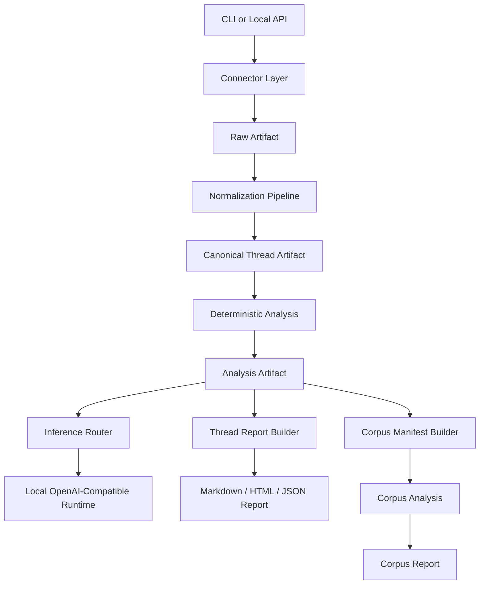

# ThreadSense System Design

## Purpose

This document describes the implemented architecture in the repository today and the main system boundaries that future changes should preserve.

## Implemented Architecture

ThreadSense is a local-first, single-process pipeline with explicit stage artifacts.



The architecture is staged, not monolithic. That is intentional. Every stage has a persisted artifact boundary.

## Major Flows

### Single-thread flow

```text
fetch -> normalize -> analyze -> optional summary -> report
```

### Reddit topic research flow

```text
subreddit search -> candidate ranking -> selected thread fetch/analyze
-> corpus manifest -> corpus analysis -> optional corpus synthesis -> corpus report
```

## Modules And Responsibilities

### Connectors

- `src/threadsense/connectors/reddit.py`
- `src/threadsense/connectors/hackernews.py`
- `src/threadsense/connectors/github_discussions.py`
- `src/threadsense/connectors/github_gist.py`

Responsibilities:

- normalize source URLs
- fetch source payloads
- validate response shape
- preserve source-specific thread metadata
- return raw artifacts for later normalization

Special notes:

- Reddit: direct thread fetch is URL-based; topic research uses explicit subreddit search with exact time-window filtering after retrieval
- GitHub Discussions: GraphQL with cursor-based pagination for comments (100/page) and replies; requires authentication token
- GitHub Gists: REST API with paginated flat comments; authentication optional for public gists; comments have no threading (all depth=0)

### Canonical Model

- `src/threadsense/models/canonical.py`
- `src/threadsense/pipeline/normalize.py`

The canonical `Thread` model is the source-agnostic internal contract.

Key properties:

- source metadata
- thread title
- thread body when available
- author metadata
- canonical comments with depth and parent links
- provenance metadata

This keeps downstream analysis source-neutral.

### Deterministic Analysis

- `src/threadsense/pipeline/analyze.py`
- `src/threadsense/pipeline/strategies/keyword_heuristic.py`

Responsibilities:

- phrase extraction
- duplicate handling
- issue/request markers
- theme grouping
- severity assignment
- evidence quote selection

### Inference Layer

- `src/threadsense/inference/contracts.py`
- `src/threadsense/inference/prompts.py`
- `src/threadsense/inference/router.py`

Responsibilities:

- task-shaped inference requests
- strict output schema validation
- required vs degraded behavior
- summary and corpus synthesis

The runtime is optional. The deterministic core still produces usable artifacts without it.

### Reporting

- `src/threadsense/reporting/build.py`
- `src/threadsense/reporting/render.py`
- `src/threadsense/reporting/corpus_render.py`
- `src/threadsense/reporting/quality.py`

Responsibilities:

- build thread reports from analysis artifacts
- generate Markdown, HTML, and JSON report outputs for thread reports
- generate Markdown corpus reports
- preserve evidence citations and run report quality checks

### Workflow Orchestration

- `src/threadsense/workflows.py`

Responsibilities:

- end-to-end single-thread runs
- report generation
- corpus manifest / analysis / report workflows
- Reddit research orchestration

## Reddit Research Design

The Reddit research workflow is implemented as discovery plus orchestration, not as a second analysis system.

### Discovery

- subreddit-scoped Reddit search
- user-facing time windows like `30d`
- coarse Reddit search bucket mapping such as `month`
- exact `created_utc` filtering after retrieval

### Query handling

Supported:

- `OR`
- `|`

Implementation detail:

- `A OR B` is executed as a union of clause searches
- local deterministic matching filters and ranks results afterward

Unsupported advanced syntax is rejected explicitly because local deterministic matching does not implement full Reddit search semantics.

### Selection

Candidate ranking uses deterministic signals:

- title phrase hits
- title term hits
- selftext phrase hits
- selftext term hits
- score
- comment count
- recency

Selection controls:

- per-subreddit cap
- global limit
- dedupe by post id

### Research Output

The research flow returns:

- selected thread metadata
- corpus manifest path
- corpus analysis path
- corpus report path
- optional corpus synthesis summary

In human mode, the CLI renders a research summary panel instead of raw JSON.

## Artifact Boundaries

ThreadSense relies on explicit persisted artifacts.

### Raw artifact

- source-specific fetched payload

### Canonical artifact

- normalized thread

### Analysis artifact

- deterministic thread findings

### Report artifact

- thread-level rendered or structured report

### Corpus manifest

- selected analysis artifact set

### Corpus analysis

- cross-thread findings and trends

### Corpus report

- final markdown output for corpora and research runs

These boundaries are critical for replayability, inspection, and debugging.

## Output Surfaces

### JSON

- command payloads
- report artifacts
- analysis artifacts

### Human mode

- single-thread run summary panel
- Reddit research summary panel

### Quiet mode

- status-only CLI output

## API Scope

The local API is a thin wrapper around the same workflow functions used by the CLI.

Current routes focus on:

- fetch
- normalize
- analyze
- infer analysis
- report analysis

The API does not yet expose the full Reddit research workflow.

## Design Constraints

### Fail fast

Unsupported query syntax, malformed connector payloads, invalid schema versions, and inconsistent report semantics should fail explicitly.

### Deterministic first

Retrieval, normalization, candidate selection, and baseline findings remain deterministic.

### Inference portability

Inference is task-based and routed through a local OpenAI-compatible contract rather than hardcoded vendor logic.

### Source-neutral downstream analysis

Once normalized, downstream analysis and reporting do not branch on source shape.

## Current Gaps

- no non-Reddit research discovery workflow yet
- no API route for `research reddit`
- no corpus HTML report yet
- research query grammar is intentionally constrained

These are product and workflow gaps, not evidence-layer gaps.
